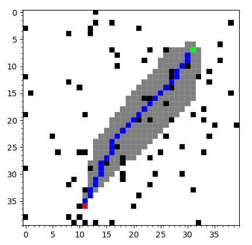
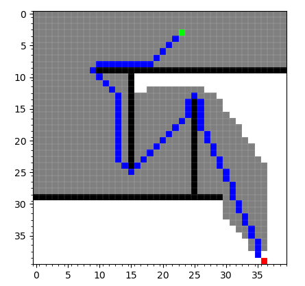
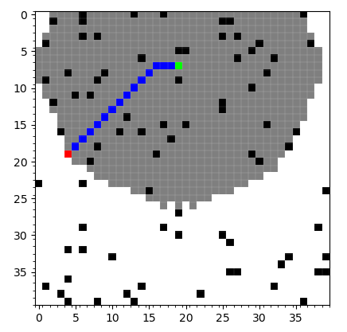
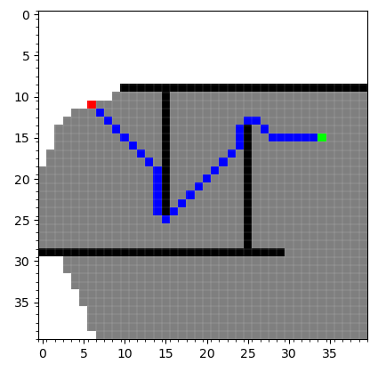

# Path Planning Algorithms

## What is in this repositroy?

In this repository, I present my implementation to various path planning algorithms in both Python and C++.

The repository currently present the following algorithms:

- A*
- Dijkstra

Other path planning algorithms will be added soon.

## Visualizing the algorithms
### A*
<table>
   <tr>
    <td> </td>
    <td></td>
   </tr> 
</table>

### Dijkstra
<table>
   <tr>
    <td> </td>
    <td></td>
   </tr> 
</table>
